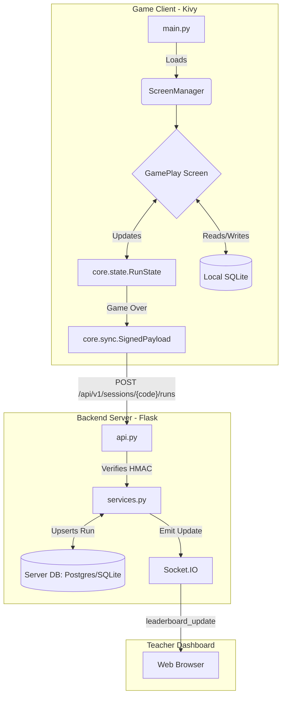

# 🐧 Penguin Dash: System Overview

## 1. Executive Summary

**Penguin Dash** is an Endless Runner game built primarily with Python and the Kivy framework, designed as an educational programming assignment. It challenges players with isometric, procedurally generated terrain, obstacle evasion, and an in-game shop system driven by a local SQLite database.

Beyond the standalone game, the project includes a robust **Flask-based Backend Server** that acts as a real-time Teacher Dashboard. This allows educators to create classroom sessions, track student scores via a live leaderboard, and securely sync game results. The dual nature of the project (Desktop Game + Web Dashboard) makes it a comprehensive full-stack Python application.

## 2. Tech Stack & Environment

### Core Languages & Frameworks
*   **Language**: Python 3.12
*   **Game Engine / UI**: Kivy 2.3.1 (Hardware-accelerated UI, input handling, and rendering)
*   **Game Audio**: ffpyplayer
*   **Backend Server**: Flask 3.1
*   **Real-time Communication**: Flask-SocketIO (for the live dashboard)

### Databases & Persistence
*   **Local Game State**: SQLite (via standard library, managed in `core/database.py`)
*   **Backend Database**: SQLite (Development) / PostgreSQL (Deployment), managed via Flask-SQLAlchemy and Flask-Migrate (Alembic).

### Development & DevOps Tools
*   **Containerization**: Docker & Docker Compose (for isolating and running the backend)
*   **Quality Assurance**: pytest (Testing), ruff (Linting & Formatting), mypy (Static Type Checking)
*   **Git Hooks**: pre-commit
*   **Build/Task Runner**: GNU Make (`Makefile`)

## 3. Architecture & Directory Structure

The repository is structured to cleanly separate the Kivy game logic from the Flask backend, ensuring modularity. The backend can only import from the `core/` module, which is strictly kept free of Kivy dependencies.

```text
Panguin-pikachu - V2/
├── main.py                 # Game entry point (initializes Kivy App & ScreenManager)
├── style.kv                # Kivy styling and layout definitions
├── core/                   # Shared business logic, state, and constants (No Kivy imports!)
│   ├── config.py           # Global configurations (screen size, grid settings)
│   ├── state.py            # Global Game State and Run State Machine
│   ├── sync.py             # Secure HMAC-signed synchronization logic
│   └── database.py         # Local SQLite manager (player, gems, skins)
├── game/                   # Gameplay mechanics and rendering logic (Kivy allowed)
│   ├── grid.py             # Procedural generation & Isometric math mapping
│   ├── penguin.py          # Player entity logic
│   └── blocks.py / gem.py  # Obstacles and collectibles
├── screens/                # Kivy Screen modules (Menu, GamePlay, GameOver, Shop)
├── ui/                     # Reusable UI widgets (HoverButton, AnimatedSkin)
├── server/                 # Flask Backend & Teacher Dashboard
│   ├── api.py              # RESTful API endpoints for game sync
│   ├── dashboard.py        # Web dashboard routes and SocketIO events
│   ├── models.py           # SQLAlchemy ORM Models
│   └── services.py         # Backend business logic
├── assets/                 # Static game assets (images, fonts, sounds)
└── scripts/                # Utility runner scripts
```

## 4. Core Components & Data Flow

The architecture is split between the Local Game Client and the Remote Dashboard Server.

### The Game Loop
1.  **State Management**: `StateManager` handles UI state while `RunState` tracks the active gameplay lifecycle.
2.  **Rendering**: `KivyRenderer` uses low-level Canvas instructions for performance, drawing entities managed by the `GridManager`.
3.  **Local Persistence**: `DatabaseManager` saves gems, purchased skins, and high scores locally to `game.db`.

### Backend Synchronization
When a player finishes a run, the game securely transmits the result to the Flask backend. To prevent cheating, requests are cryptographically signed using an HMAC-SHA256 signature, ensuring data integrity.

### Data Flow Diagram



## 5. Entry Points & Routing

### Game Entry Point
*   **`main.py`**: Running `python main.py` triggers the `PenguinDashApp`.
*   **Initialization Flow**:
    1.  Calls `DatabaseManager().init_db()` to prepare local storage.
    2.  Loads the global `style.kv` for UI presentation.
    3.  Initializes a `ScreenManager` containing `MenuScreen`, `GamePlayScreen`, `ShopScreen`, etc.

### Backend Entry Point
*   **`server/__main__.py`**: Running `python -m server` (or via Docker Compose) spins up the Flask application.
*   **Factory**: `server/__init__.py::create_app()` constructs the Flask app, configuring SQLAlchemy, SocketIO, and Flask-Limiter.

### External API & Routing
The server exposes several endpoints for interaction:

#### REST API (`/api/v1`)
*   `POST /sessions`: Creates a new session, returning a `room_code` and a `teacher_token`.
*   `POST /sessions/<room_code>/join`: Registers a player to a session.
*   `POST /sessions/<room_code>/runs`: Submits a completed run's score (Requires HMAC signature).
*   `POST /sessions/<room_code>/end`: Ends a session (Requires `X-Teacher-Token` header).
*   `GET /sessions/<room_code>/leaderboard`: Fetches the current JSON leaderboard.

#### Dashboard & Web Sockets (`/dashboard`)
*   `GET /dashboard/`: The web interface to create a session.
*   `GET /dashboard/<room_code>`: The live dashboard view.
*   **SocketIO**: Listens for the `join_dashboard` event and broadcasts `leaderboard_update` and `session_ended` to connected browsers in real-time.
