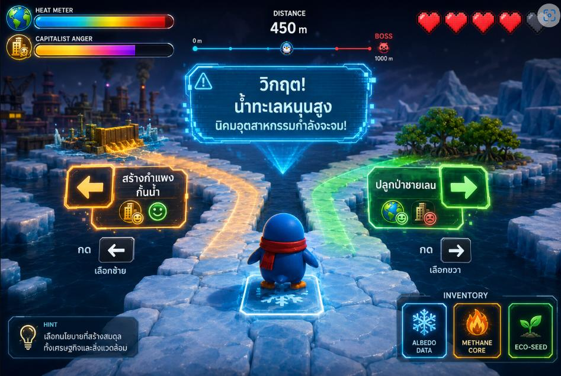
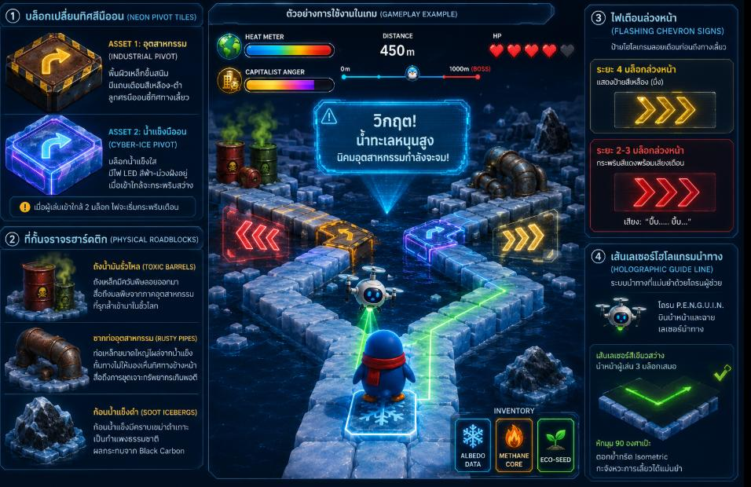
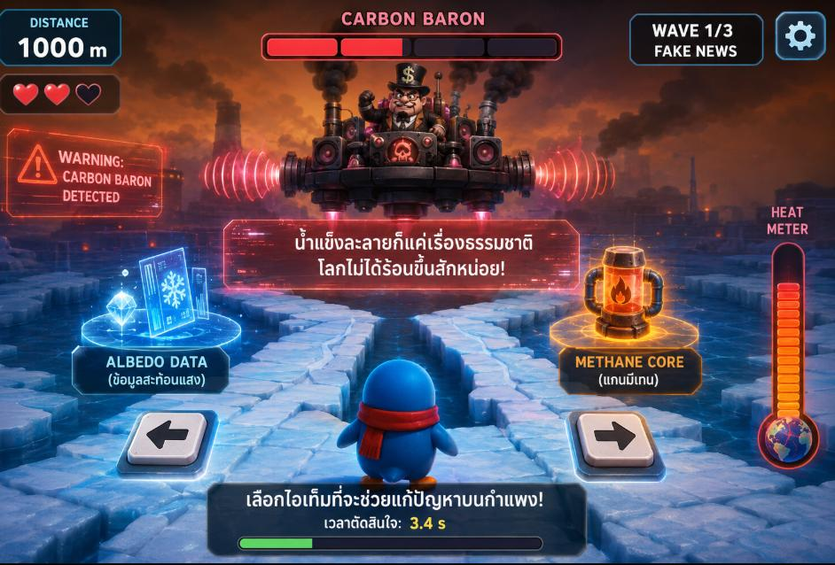

# Game Design Document — Penguin Dash (NSC2026, GDD V.2)

> **เอกสารนี้คือ "แหล่งความจริงด้านดีไซน์เกม" (single source of design truth)** — แปลงจาก `NSC2026-V.2.pdf` (PROJECT MASTER DOCUMENT).
> ส่วน **สถาปัตยกรรม/การตัดสินใจเชิงวิศวกรรม** อยู่ที่ [ENGINEERING_PLAN.md](ENGINEERING_PLAN.md) + [adr/](adr/); **แผนงาน sprint** อยู่ที่ [SPRINT_2DAY.md](SPRINT_2DAY.md); **state machine ทุกตัว** รวมที่ [state-machines.md](state-machines.md); **ค่าตัวเลข balance** เป็น data file ที่ [../balance/](../balance/) (เอกสารสรุปอ่านที่ [BALANCE.md](BALANCE.md)).

## บทนำ (Executive Summary)

โปรเจกต์นี้ขับเคลื่อนด้วย **นวัตกรรมระบบเกมเพลย์หลัก (Core Gameplay Mechanics)** — เกมวิ่งระยะทาง 1,000 เมตร ที่ผสมความสนุกของ endless runner เข้ากับ **การประเมินผลเชิงระบบ (Systemic Thinking)** ผ่านการตัดสินใจภายใต้ข้อจำกัดของโลกความเป็นจริง เพื่อให้ผู้เรียนเข้าใจวิกฤตสิ่งแวดล้อมอย่างลึกซึ้ง

**สารบัญ:**
1. [กลไกหลักและการดำเนินเกม (Core Progression)](#1-กลไกหลักและการดำเนินเกม-core-progression)
2. [ระบบเพิ่มความง่าย (Accessibility & Scaffolding)](#2-ระบบเพิ่มความง่าย-accessibility--scaffolding)
3. [ระบบความสัมพันธ์เชิงลึก (Trade-offs & Evidence-to-Stats)](#3-ระบบความสัมพันธ์เชิงลึก-trade-offs--evidence-to-stats)
4. [ฉากต่อสู้บอส (Boss Phase)](#4-ฉากต่อสู้บอส-boss-phase)
5. [ระบบการตัดจบและคิดคะแนน (Stealth Assessment)](#5-ระบบการตัดจบและคิดคะแนน-stealth-assessment)
6. [ชุดข้อมูล 10 ทางแยก (Y-Junction Policy Encounters)](#6-ชุดข้อมูล-10-ทางแยก-y-junction-policy-encounters)
7. [รายละเอียดระบบสำหรับ Backend (Scoring 2 มิติ)](#7-รายละเอียดระบบสำหรับ-backend-scoring-2-มิติ)

> **หมายเหตุการรวมดีไซน์ (merge เก่า+ใหม่):** GDD V.2 นี้ refine ดีไซน์เดิมใน [OVERVIEW.md](OVERVIEW.md) โดยระบบพื้นฐาน (pre/post-test + Hake Gain, sync, dashboard) ยังคงอยู่ ส่วนที่กลับทิศ/เพิ่มใหม่ (หัวใจ + Game Over จริง, Stealth Assessment, DAG report card) มี ADR รองรับ — ดู [adr/010](adr/010-health-respawn-state-model.md), [adr/011](adr/011-learning-evaluation-pipeline.md)

---

## 1. กลไกหลักและการดำเนินเกม (Core Progression)

### 1.1 ระบบสุ่มเจอคำถามระยะไม่เกิน 100m (Zone-Based Spawning)

สร้างเพื่อความยุติธรรมในการให้คะแนน + ความสนุกที่คาดเดาไม่ได้ (Active Learning)

- **โครงสร้างระยะทาง:** รวม 1,000 เมตร
- **การแบ่งโซน:** 10 โซน × 100 เมตร
- **อัตราการเกิด:** สุ่มสร้างทางแยกนโยบาย **1 ครั้ง/โซน**
- **ความยุติธรรมแบบสุ่ม:** ทุกคนเจอทางแยก 10 ครั้งเท่ากัน (คะแนนเต็ม 10 เท่ากัน) แต่ **จังหวะเจอคาดเดาไม่ได้** — เช่น เจอตอน 90m แล้วเจออีกที 130m (ห่าง 40m) หรือทิ้งช่วง 140m→290m (ห่าง 150m)
- **การแบ่งหมวดตามโซน:** โซน 1–3 = "สาเหตุ", โซน 4–6 = "ผลกระทบ", โซน 7–10 = "การแก้ปัญหา"

### 1.2 ระบบทางแยก (Y-Junction)

- **การทำงาน:** ถึงทางแยก เกมมีบล็อกให้กระโดดขึ้นยืน → **หยุดการละลายของน้ำแข็งชั่วคราว**
- **การแสดงผล:** ป้ายให้เลือกนโยบายสิ่งแวดล้อม/เศรษฐกิจ (ซ้าย/ขวา)
- **การควบคุม:** กด **ลูกศรซ้าย/ขวา** เลือกเส้นทางนโยบาย → apply stat delta → กลับเข้า endless-run ปกติ

---

## 2. ระบบเพิ่มความง่าย (Accessibility & Scaffolding)

### 2.1 ระบบหัวใจ 5 ดวง

- **ทรัพยากรเริ่มต้น:** หัวใจ 5 ดวงบนหน้าจอ
- **เงื่อนไขการลดลง:** ตกเหว = **−1 หัวใจ** + กลับมาจุดเดิม (checkpoint) เล่นต่อ
- **การฟื้นฟู:** เก็บหัวใจเพิ่มได้ระหว่างทาง (pickup logic เดียวกับไอเทม, cap 5)
- **Game Over:** หัวใจหมด = จบเกม

> รายละเอียด state transition (invincible frame, respawn timing, พฤติกรรมในบอส) ดู [state-machines.md § Hearts](state-machines.md)

### 2.2 ระบบจับจังหวะเลี้ยว (Visual Scaffolding)

ลดปัญหา Depth Perception ของมุมมอง Isometric:
- **Neon Pivot Tiles:** บล็อกจุดหักศอกเปลี่ยนจากฟ้าใสเป็นเหล็กเหลือง-ดำลายเฉียง / น้ำแข็งเรืองแสงนีออน พร้อมลูกศรบนพื้น
- **Physical Roadblocks:** วัตถุบล็อกสายตาที่ขอบนอกของจุดเลี้ยว — ป้ายจราจรสะท้อนแสง, ถังน้ำมันเก่า, ก้อนน้ำแข็งดำ, ปล่องท่ออุตสาหกรรม
- **Flashing Chevron Signs:** ป้ายโฮโลแกรมลอยตัว กระพริบแดง/เหลืองเมื่อเข้าใกล้ 3 บล็อกล่วงหน้า
- **Holographic Guide Line (P.E.N.G.U.I.N drone):** เส้นเลเซอร์เขียวนำหน้า 2–3 บล็อก หักมุม 90° ให้เห็นทางเลี้ยวล่วงหน้า *(P2 — ตัดได้ถ้าเวลาไม่พอ)*

---

## 3. ระบบความสัมพันธ์เชิงลึก (Trade-offs & Evidence-to-Stats)

### 3.1 ระบบหลอดวัดคู่ขนาน (Dual-Meter Trade-offs)

สอนให้เข้าใจ Real-world constraints ตรงหัวใจ Systemic Thinking

- **องค์ประกอบหน้าจอ:** **Heat Meter** (มิติสิ่งแวดล้อม) + **Capitalist Anger** (มิติเศรษฐกิจ/ปากท้อง)
- **เงื่อนไข:** ต้องรักษาสมดุล 2 ขั้วอำนาจ — **หลอดใดหลอดหนึ่งแตะ 100 = Game Over**

> ค่าเริ่มต้น, ทิศทาง +/−, decay, และเงื่อนไข game-over ที่แน่นอน ดู [state-machines.md § Dual-Meter](state-machines.md) และ [adr/009](adr/009-dual-meter-model.md)

### 3.2 ระบบเปลี่ยนหลักฐานเป็นพลังโจมตี (Evidence-to-Stats)

ไอเทมที่เก็บระหว่างทาง = อาวุธ/ยา อิงวิทยาศาสตร์จริง สะสมไว้สู้บอส (แสดงใน inventory 3 ช่อง):

| ไอเทม | บทบาท | หลักวิทยาศาสตร์ |
|---|---|---|
| **Albedo Data** ❄️ | พลังโจมตีเจาะเกราะ | ค่าการสะท้อนแสงขั้วโลก (Albedo) — น้ำแข็งละลาย → โลกร้อนแบบทวีคูณ |
| **Methane Core** 🔥 | คริติคอลดาเมจ | ก๊าซมีเทน (CH₄) กักความร้อนรุนแรงกว่า CO₂ ~80 เท่าใน 20 ปี; Permafrost = ระเบิดเวลา |
| **Eco-Seed** 🌱 | พลังฮีล/ฟื้นฟู | กด **Spacebar** ในเฟสหลบหลีก → ลด Heat Meter + ซ่อมบล็อกน้ำแข็ง (Nature-based Solutions) |

---

## 4. ฉากต่อสู้บอส (Boss Phase)

### 4.1 การเปลี่ยนผ่านและภาพ (Scene Transition)

- **สัญญาณเตือน (980–990m):** ป้ายโฮโลแกรม "WARNING: CARBON BARON DETECTED"
- **การเปลี่ยนฉาก (1,000m):** ทางวิ่งซิกแซกขยายเป็นแพน้ำแข็งกว้าง, ท้องฟ้าฟ้า→ส้มหม่น+smog, เพลงเปลี่ยนเป็น Boss Theme
- **การปรากฏตัว:** Carbon Baron (หุ่นยนต์ตะขาบยักษ์พ่นควัน) ลอยอยู่หน้าผู้เล่น รักษาระยะห่างคงที่

### 4.2 สนามรบและกลไก (Arena)

- **The Problem Wall:** บอสยิงกำแพงโฮโลแกรมมี "ข้อความหลอก/ข่าวลวง" (สโลว์โมชั่น 3–4 วิให้อ่าน)
- **Y-Junction Split:** ก่อนชนกำแพง พื้นแยก 2 เลน แต่ละเลนมีโมเดล 3D ไอเทม
- **Action:** กดลูกศรซ้าย/ขวากระโดดไปเลนไอเทมที่แก้ปัญหาบนกำแพงได้ถูกต้อง

### 4.3 ลำดับการโจมตี (3 Waves — บอสมีเกราะ 3 ขีด, ตอบถูก 3 ครั้ง = ชนะ)

| Wave | ข้อความกำแพง | ✅ ตอบถูก | ❌ ตอบผิด |
|---|---|---|---|
| **1 · Fake News** | "น้ำแข็งละลายก็แค่เรื่องธรรมชาติ โลกไม่ได้ร้อนขึ้นสักหน่อย!" | **Albedo Data** → เกราะแตก (บอส −1 ขีด) | Methane Core → เด้งกลับ (ผู้เล่น −1 หัวใจ) |
| **2 · วิกฤตแทรกซ้อน** | "Permafrost ละลาย! ก๊าซมีเทนรั่วไหลรุนแรงกว่า CO₂ หลายเท่า!" | **Methane Core** → เครื่องสกัดดูดควัน (บอส −1 ขีด) | Eco-Seed → ต้นไม้ตายเพราะมีเทน (ผู้เล่น −1 หัวใจ) |
| **3 · ประนีประนอมกับระบบ** | "ความร้อนทะลุขีดจำกัด! ระบบนิเวศกำลังจะพังทลาย!" | **Eco-Seed** → ป่าโฮโลแกรมดูดความร้อน (บอส −ขีดสุดท้าย) | Albedo Data → ไม่ช่วยลดอุณหภูมิวิกฤต (ผู้เล่น −1 หัวใจ) |

### 4.4 เงื่อนไขผลลัพธ์ (Win/Loss)

- **Game Over (แพ้):** หัวใจ = 0 → "ระบบนิเวศล่มสลาย ลองกลับไปทบทวนความสัมพันธ์ของระบบใหม่นะ"
- **Victory (ชนะ):** บอสเลือด = 0 → เครื่องจักรระเบิด, ท้องฟ้ากลับมาสดใส, บล็อกน้ำแข็งซ่อมด้วยเอฟเฟกต์เขียว → เข้าหน้า Report Card

---

## 5. ระบบการตัดจบและคิดคะแนน (Stealth Assessment)

นำ **การตัดสินใจ 13 ครั้ง** (10 ทางแยกช่วงวิ่ง + 3 เวฟบอส) มาแปลงเป็นคะแนน + วาดแผนภาพสรุปอัตโนมัติ

### 5.1 การเก็บ Log (Client-side Memory)

ทุกจุด Y-Junction บันทึก log ผูกกับ "เส้นความสัมพันธ์ (Edge)" ใน DAG:
- **Decision 1–10 (ช่วงวิ่ง):** วัดความรู้พื้นฐานแต่ละตัวแปร
- **Decision 11–13 (ช่วงบอส):** วัดความเข้าใจผลกระทบลูกโซ่

### 5.2 ฉากจบและสมุดพกเชิงระบบ (Systemic Report Card)

หน้าจอสรุปแบบไซไฟ วาด **Auto-Generated DAG** ทีละเส้น:
- **เส้นเขียว (สว่าง):** เลือกถูก (เช่น ต้นไม้ → CO₂)
- **เส้นแดง (สั่น/ขาด):** เลือกพลาด/โดนหลอก (เช่น ต้นไม้ → Methane) + **Tooltip เฉลย**
- **Grade & Impact Score:** สรุปเป็น **"อุณหภูมิโลกที่กอบกู้ได้"** (เช่น ลด 1.5°C ระดับ Eco-Master)

> DAG เป็น **domain pipeline** (Decision Graph → Evaluation → Projection → Renderer) ไม่ใช่แค่ UI — server อาจ render ได้เหมือนกัน ดู [adr/011](adr/011-learning-evaluation-pipeline.md)

---

## 6. ชุดข้อมูล 10 ทางแยก (Y-Junction Policy Encounters)

> **นี่คือ content dataset** ป้อนเข้า Zone-Based Spawning — ค่าจริงเก็บที่ [`balance/v1/junctions.json`](../balance/) (ตารางนี้คือ human-readable mirror, generate ผ่าน [BALANCE.md](BALANCE.md))
>
> **การกำหนดค่า (ฐาน 100, หลอดเต็ม 100 = Game Over):**
> - **Heat Meter:** `+` = ร้อนขึ้น (แย่ลง) / `−` = เย็นลง (ดีขึ้น)
> - **Capitalist Anger:** `+` = โกรธมากขึ้น (แย่ลง) / `−` = พอใจ (ดีขึ้น)
>
> ทุกตัวเลือกไม่มี "ถูก 100% โดยไม่เสียอะไร" — ต้องรักษาสมดุลไปจนจบ 1,000m. คอลัมน์ **Systemic** = ตัวเลือกแก้ที่ต้นเหตุ (ให้ 0.1°C + เส้นเขียวใน DAG)

### ภาคที่ 1: หมวดสาเหตุ (Causes) — โซน 1–3

| # | สถานการณ์ | ⬅️ ซ้าย | Heat / Anger | ➡️ ขวา | Heat / Anger | Systemic |
|---|---|---|---|---|---|---|
| 1 | วิกฤตพลังงานเมืองหลวง | อนุมัติโรงไฟฟ้าถ่านหิน | +25 / −20 | บังคับใช้โซลาร์ฟาร์ม | −20 / +25 | ขวา |
| 2 | สัมปทานผืนป่า | ระงับสัมปทาน+เขตป่าสงวน | −20 / +25 | อนุมัติสัมปทานกระตุ้นส่งออก | +25 / −25 | ซ้าย |
| 3 | รถติดและควันดำ | อุดหนุน EV (รถเท่าเดิม) | −5 / −20 | เก็บภาษีรถติด → รถเมล์ฟรี | −25 / +25 | ขวา |

> ทางแยกที่ 3 ซ้าย = ตัวเลือกประนีประนอม (ซื้อใจนายทุนได้มาก ช่วยโลกน้อย)

### ภาคที่ 2: หมวดผลกระทบ (Impacts) — โซน 4–6

| # | สถานการณ์ | ⬅️ ซ้าย | Heat / Anger | ➡️ ขวา | Heat / Anger | Systemic |
|---|---|---|---|---|---|---|
| 4 | ระดับน้ำทะเลรุกคืบ | ทุ่มงบสร้างกำแพงกั้นน้ำยักษ์ | +20 / −25 | ย้ายนิคม+ฟื้นฟูป่าชายเลน | −25 / +30 | ขวา |
| 5 | ภัยแล้ง+วิกฤตอาหาร | แจกเงินอุดหนุนสารเคมีเร่งโต | +25 / −20 | เปลี่ยนพืชทนแล้ง+เกษตรอินทรีย์ | −20 / +25 | ขวา |
| 6 | ระเบิดเวลา Permafrost | ปล่อยผ่าน (ไม่มีมูลค่าเศรษฐกิจ) | **+40** / −10 | บังคับเอกชนสร้างโดมดูดมีเทน | −35 / +35 | ขวา |

> ทางแยกที่ 6 ซ้าย = ตัวเลือกอันตราย (หลอดโลกอาจแตกทันที)

### ภาคที่ 3: หมวดการแก้ปัญหา (Solutions) — โซน 7–10

| # | สถานการณ์ | ⬅️ ซ้าย | Heat / Anger | ➡️ ขวา | Heat / Anger | Systemic |
|---|---|---|---|---|---|---|
| 7 | ภาษีคาร์บอน (Carbon Tax) | อนุมัติภาษีคาร์บอนก้าวหน้า | −35 / +35 | ชะลอกฎหมายรักษาการจ้างงาน | +30 / −30 | ซ้าย |
| 8 | ขยะ Fast Fashion | ผลักดัน Circular Economy | −25 / +25 | ส่งเสริมแคมเปญกระตุ้นยอดขาย | +25 / −25 | ซ้าย |
| 9 | แหล่งกักเก็บคาร์บอน | เปิดเสรีพื้นที่สีเขียวให้เอกชน | +30 / −30 | เก็บภาษีที่ดินรกร้าง→ป่ากลางเมือง (NbS) | −30 / +30 | ขวา |
| 10 | โค้งสุดท้าย (Tipping Point) | ระงับฟอสซิล 100% ทั่วประเทศ | **−50** / **+50** | ซื้อคาร์บอนเครดิตฟอกเขียว | **+50** / **−50** | ซ้าย |

> ทางแยกที่ 10 = ตัวเลือกวัดใจ/ชี้เป็นชี้ตาย — เสี่ยงทำหลอดพังก่อนถึงบอส

---

## 7. รายละเอียดระบบสำหรับ Backend (Scoring 2 มิติ)

> เอกสารนี้ระบุ **สูตร**; การตัดสินใจว่าคะแนนเป็น projection (recompute จาก event log) และการแยก 3 concern อยู่ที่ [adr/011](adr/011-learning-evaluation-pipeline.md) + [adr/012](adr/012-runresult-contract.md). โค้ดอยู่ `core/scoring/` (ห้าม import kivy)

ระบบไม่วัดว่า "เลือกรักษ์โลกที่สุดทุกข้อ" แต่แบ่งเป็น 2 มิติ:

### มิติ 1 — Impact Score (คะแนนอุณหภูมิที่ลดได้ / Survival & Trade-off)

- คุมความสนุก+กดดันผ่านหลอดคู่ วัด "ทักษะเอาตัวรอดภายใต้ข้อจำกัด"
- นโยบายแต่ละข้อเพิ่ม/ลดอุณหภูมิ **ไม่เท่ากัน** — คนเข้าใจระบบจะรู้ว่าตอนไหน "ยอมเสีย" (เช่น ทางแยก 3) ตอนไหน "ปกป้องเด็ดขาด" (เช่น ทางแยก 6 Permafrost)
- **สูตร:** `Total Impact = Σ(ΔTemp_i, i=1..10) + Boss Bonus`
- รอดถึง 1,000m = เก่งเรื่อง balance แล้ว วัดแค่ว่า "มีประสิทธิภาพ" แค่ไหน

### มิติ 2 — Cognitive Score (ความรู้สัมบูรณ์จากบอส)

- ฉากบอส = "ขาว-ดำ" วัดความรู้วิทยาศาสตร์เป๊ะ ๆ (Summative Assessment)
- ตอบถูก **เวฟละ +0.1°C** (perfect 3 เวฟ = สูงสุด **0.5°C**); ตอบผิด (หัวใจลด) = โดนหักส่วนนี้ทิ้ง

### มิติ 3 — Net Impact Score ("อุณหภูมิที่ลดได้") + Rank

- ตัวเลือก **Systemic Solution** (เช่น ภาษีคาร์บอน): ลด **0.1°C/ข้อ** + เส้น**เขียว**ใน DAG
- ตัวเลือก "แก้ปลายเหตุ"/"ยอมจำนนต่อทุน": **0°C** + เส้น**แดงสั่น**ใน DAG (แม้เซฟหลอดนายทุน)
- รวม 10 ข้อถูกเผงทุกข้อ = สูงสุด **1.0°C** จากการวิ่ง
- **Final Grading:** อุณหภูมิเริ่มวิกฤต +2.0°C → รวมคะแนนซ่อน (1.0°C วิ่ง + 0.5°C บอส = 1.5°C) → แสดง "อุณหภูมิโลกที่คุณกอบกู้ไว้ได้" + rank:

| Rank | ช่วง °C | ระดับ |
|---|---|---|
| **S** | 1.3–1.5°C | Eco-Systemic Master — บริหารหลอดนายทุนไม่แตกโดยแทบไม่ฟอกเขียว, DAG เขียวสวยงาม |
| **A** | 0.8–1.2°C | Green Negotiator — เข้าใจปัญหา แต่ยอมแก้ปลายเหตุบ้างเพื่อเซฟหลอดเศรษฐกิจ |

### เจตนาของเส้น DAG

เส้นแดง/เขียว **ไม่ได้บอกว่านายทุน = สิ่งเลวร้าย** แต่บอกว่าผู้เล่นเข้าใจ **เหตุและผล (Cause & Effect)** ถูกหรือไม่ — เช่น เลือก "โรงไฟฟ้าถ่านหิน" จะลากเส้นเขียวจาก [ถ่านหิน]→[CO₂ พุ่ง] และ [เศรษฐกิจโต] (เข้าใจถูก) แต่ถ้าใช้ไอเทมผิดในบอสจะลากเส้นแดง + Tooltip เฉลย — วัดผลได้จริงโดยไม่ยัดเยียดอุดมการณ์
