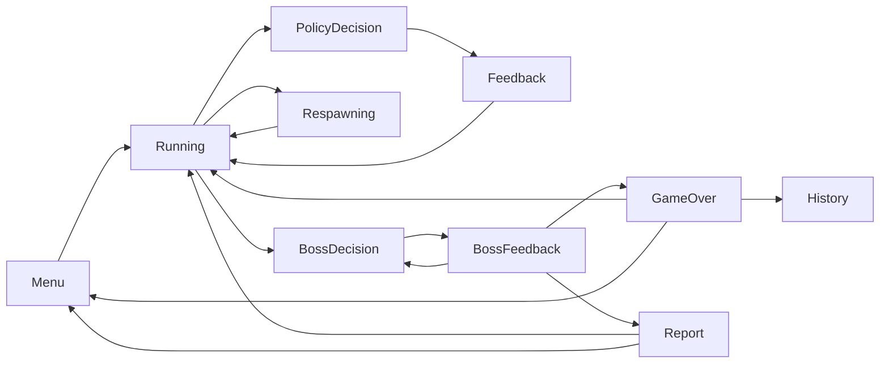

# UI/UX Handoff — Penguin Dash 0.1

> อ่าน `GAME_FIRST_PLAN.md` ก่อน เอกสารนี้เป็น spec/handoff ไม่ใช่แหล่งสถานะงาน

## เป้าหมาย

ทำให้ผู้เล่นเข้าใจ “ตอนนี้ต้องทำอะไร / การตัดสินใจส่งผลอะไร / ทำไมรอบจบ” ภายใน 2 วินาที
โดย UI อ่าน `GameplayViewState` และส่ง command กลับ `GameplayController`; ห้ามแก้ `GameSession`,
`RunMetrics`, inventory หรือ event log โดยตรง

## State map



ทุก state ต้องระบุ input ที่รับ, primary CTA, overlay priority, sound cue และ recovery behavior

## Component ownership

| Component | Reads from ViewState | Sends command/event | UX acceptance |
|---|---|---|---|
| HUD rail | distance, gems, hearts, meters, inventory | none | อ่านได้บนพื้นหลังสว่าง/มืด |
| Decision card | situation, left/right choice, countdown | decision command | ทางเลือกไม่สลับตำแหน่งระหว่าง render |
| Feedback toast | feedback | none | ไม่บัง path และหายตามเวลาที่กำหนด |
| Respawn overlay | countdown, terminal reason | none | แยก respawn จาก Game Over ชัดเจน |
| Boss banner | wave, armor, choices | decision command | wave/armor เห็นได้ใน glance เดียว |
| State overlay | pause/recoverable error | pause/resume/restart | error บอก action และตำแหน่ง log |

## Layout contracts

- Reference resolutions: 1280×720 และ 1920×1080, 16:9
- Safe margin อย่างน้อย 24 px ที่ 1280×720; ห้ามวาง CTA ชิดขอบหน้าต่าง
- Gameplay path ต้องไม่ถูก HUD/overlay บังบริเวณกลางจอ
- Thai text ใช้ Noto Sans Thai; Latin display ใช้ Kenney Future
- ข้อความต้อง wrap ไม่ clip; button hit target อย่างน้อย 44×44 px
- สีไม่เป็น signal เดียว: meter/choice/error ต้องมีข้อความหรือ icon ร่วมด้วย

## Overlay priority

```text
Fatal startup screen
  > Game Over / Report navigation
  > Boss decision
  > Policy decision
  > Respawn
  > Pause
  > Feedback toast
  > HUD
```

Overlay priority สูงกว่าต้อง disable input ของชั้นล่าง แต่ render loop ยังทำงานสำหรับ animation ที่จำเป็น

## Visual QA evidence

เจ้าของ UI ส่งภาพ `menu`, `running`, `policy`, `respawn`, `boss`, `gameover`, `report`, `history`
ที่ 1280×720 และ 1920×1080 พร้อมบันทึก OS/GPU/build SHA. ภาพอ้างอิงที่เปลี่ยนต้องมีเหตุผลใน PR;
ผล verify จริงบันทึกที่ STATUS ใน `GAME_FIRST_PLAN.md` เท่านั้น

## UI Definition of Done

- ทุก mutable action ผ่าน controller command
- Snapshot เก่า render ซ้ำได้โดยไม่เปลี่ยน
- Keyboard/mouse input ไม่ทะลุ overlay
- Recoverable save/audio error แสดงข้อความแต่ไม่บังคับออกจากเกม
- Fatal startup ไม่สร้าง gameplay screen
- Physical playtest 10 นาทีไม่มี text clip, stuck overlay หรือ input loss
